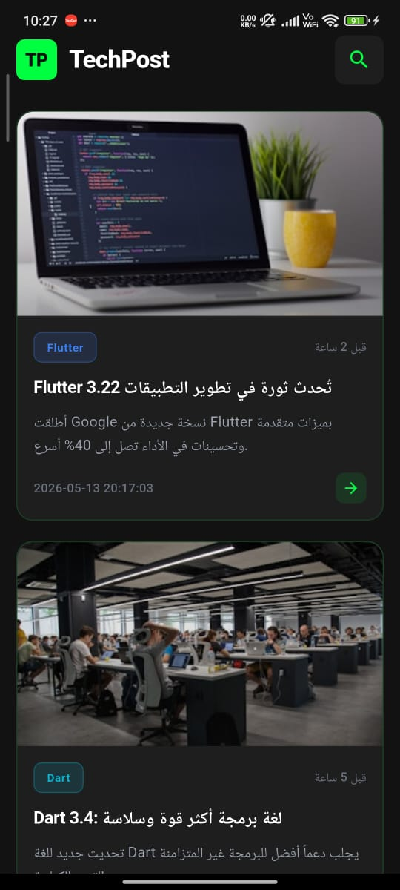

# 🚀 TechPost - News App

A modern, high-performance tech news application built with Flutter, featuring a **Neon Tech Dark Mode** and robust **MVVM Architecture**.

## ✨ Key Features
* **Neon Tech UI**: A sleek dark theme (#121212) with vibrant neon green accents (#00FF41).
* **MVVM Architecture**: Clear separation of concerns between Models, ViewModels, and Views.
* **State Management**: Professional handling of UI states (Loading, Success, and Error).
* **Pull-to-Refresh**: Modern user experience for updating the latest tech news.
* **Clean Code**: Highly organized folder structure for scalability.

## 📸 Preview


## 🛠️ Technical Implementation
* **Pattern**: MVVM (Model-View-ViewModel).
* **Style**: Dark Mode with Neon Accents.
* **Widgets**: Dynamic ListView, Custom News Cards, and SnackBar Navigation.

## 🚀 Getting Started
1. Clone the repo:
   ```bash
   git clone [https://github.com/Ahmed-Elzaher/tech_post.git](https://github.com/Ahmed-Elzaher/tech_post.git)
Install dependencies:

Bash
flutter pub get
Run the app:

Bash
flutter run
